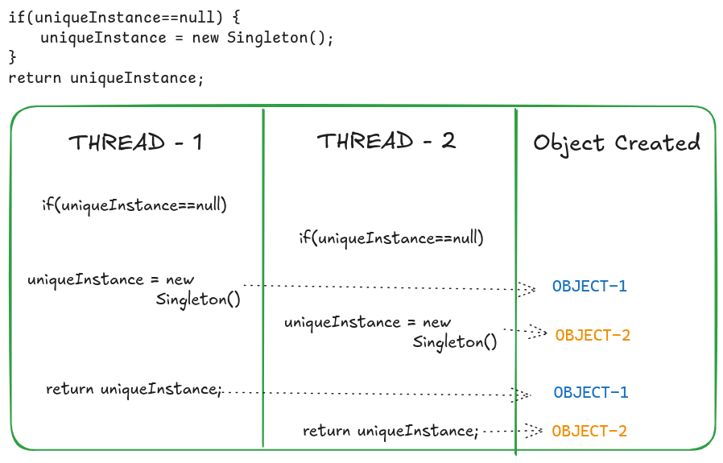

### Definition

- Two Main Features 
	- One and only one instance of the class
	- Global access to the instance of the class

### Implementation

```Java
package io.sriki;

public class Singleton {

    // for providing the global access, static variable (class variable) is used
    private static Singleton singleton;

    private int first;
    private int second;

    // Singleton classes can only be instantiated using the static method to control the creation of object.
    // so the constructor is private

    private Singleton(){
        this.first=0;
        this.second=10;
    }

    public static Singleton getInstance() {

        // instance is not created yet ( LAZY INSTANTIATION )
        if(singleton == null){
            singleton = new Singleton();
        }
        // if instance is not null, return the instance
        return singleton;
    }

    public int getFirst(){
        return this.first;
    }

    public int getSecond() {
        return this.second;
    }

}

```

-  Both instance variable and constructor  are  <mark style="background: #D2B3FFA6;">private</mark>
-  Both instance variable and *getInstance()* are <mark style="background: #FF5582A6;">static</mark>


### Multi-Thread scenario

- If multiple threads are running simultaneously then there is a possibility of creating more than one instance



```Java
package io.sriki;

public class SingletonMainClass {
    public static void main(String[] args) {
        Thread t1 = new Thread(new TestRunner());
        Thread t2 = new Thread(new TestRunner());
        Thread t3 = new Thread(new TestRunner());
        Thread t4 = new Thread(new TestRunner());
        Thread t5 = new Thread(new TestRunner());
        Thread t6 = new Thread(new TestRunner());
        Thread t7 = new Thread(new TestRunner());
        Thread t8 = new Thread(new TestRunner());
        Thread t9 = new Thread(new TestRunner());
        t1.start();
        t2.start();
        t3.start();
        t4.start();
        t5.start();
        t6.start();
        t7.start();
        t8.start();
        t9.start();
    }
}

```

**OUTPUT**


#### Solution for Multi-Threading problem

##### 1. Using *synchronized* keyword

- Make the *getInstance()* method <mark style="background: #ADCCFFA6;">synchronized</mark> to make sure it is executed by only one thread at a time
```Java
public static synchronized Singleton getInstance() {

        // instance is not created yet ( LAZY INSTANTIATION )
        if(singleton == null){
            singleton = new Singleton();
        }
        // if instance is not null, return the instance
        return singleton;
    }
```

OUTPUT


